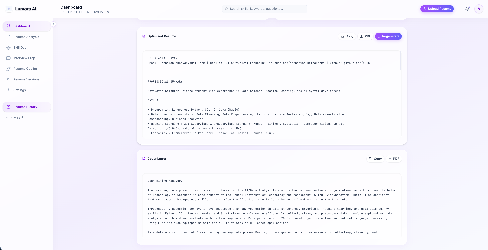
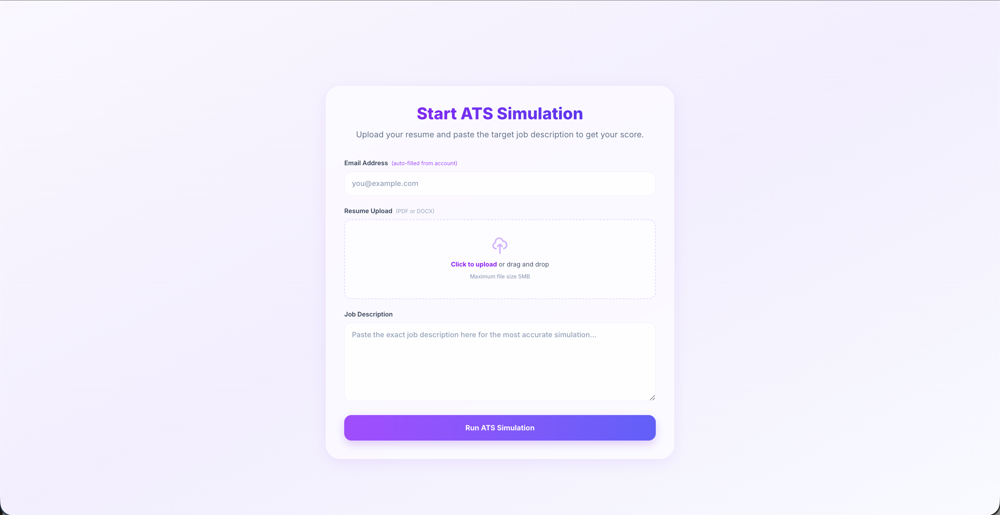
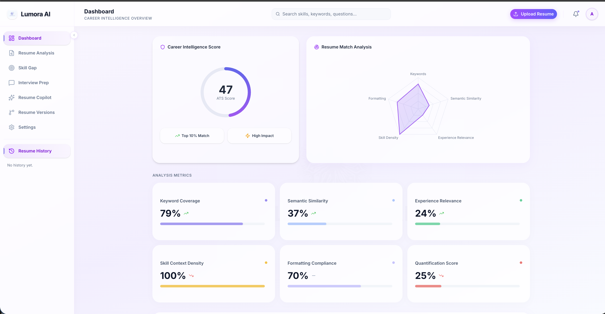
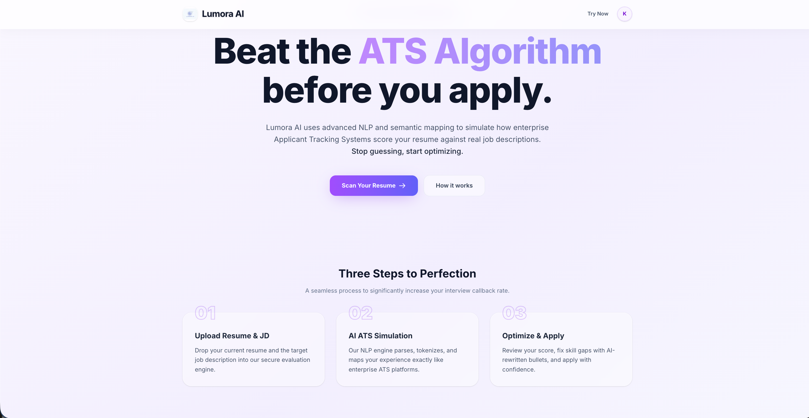

# Lumora AI


### AI-powered resume intelligence platform for the modern recruiter and candidate.

---

## 🌐 Live Demo

Experience Lumora AI in action:
* **Frontend:** [https://lumora-ai-peach.vercel.app/](https://lumora-ai-peach.vercel.app/)
* **Backend:** [https://lumora-backend-v1v3.onrender.com](https://lumora-backend-v1v3.onrender.com)

---

## 📸 Screenshots

| Analysis — Strengths & Weaknesses | Optimized Resume & Cover Letter |
| -------------------------------- | -------------------------------- |
|  |  |

| ATS Upload Simulation | Save Analysis Modal |
| --------------------- | ------------------- |
|  |  |

| Dashboard Overview | Resume History |
| ------------------ | -------------- |
|  |  |
---

## 🚀 Features

*   **⚡ ATS Score Engine** – Proprietary scoring algorithm analyzing keyword density, semantic relevance, and formatting.
*   **🤖 AI Resume Optimization** – Powered by Google Gemini to rewrite bullet points for maximum impact.
*   **🔍 Skill Gap Detection** – Instant identification of missing hard and soft skills based on job descriptions.
*   **💬 Resume Copilot Chat** – Real-time AI consultation to refine your resume interactively.
*   **📜 Resume History** – Secure storage and retrieval of past analysis sessions.
*   **📝 Cover Letter Generator** – Auto-generated, tailored cover letters matching the specific role.
*   **🎯 Interview Preparation** – AI-curated interview questions based on the candidate's profile and the target job.

---

## 🛠 Tech Stack

### Frontend
- **Framework:** Next.js (App Router)
- **Styling:** Tailwind CSS
- **UI Components:** shadcn/ui
- **Analytics Visualization:** Recharts

### Backend
- **Framework:** FastAPI (Python)

### AI/ML
- **NLP Engine:** spaCy
- **Embeddings:** sentence-transformers
- **LLM:** Google Gemini API

### Database & Infrastructure
- **Database:** Supabase (PostgreSQL)
- **Deployment:** Vercel (Frontend), Render (Backend)

---

## 🏗 Architecture

Lumora AI follows a modern decoupled architecture:

1.  **Frontend (Next.js):** Handles the user interface, file uploads (PDF/Docx), and visual analytics. It communicates directly with **Supabase** for user authentication and session management.
2.  **Backend (FastAPI):** The core intelligence layer. It processes resumes, runs the NLP pipeline (keyword extraction & semantic scoring), and manages interactions with Google Gemini.
3.  **Supabase:** Serves as the central data store for user profiles, analysis history, and metadata.

**Architecture Flow:**
`User` ⇄ `Frontend` ⇄ `Backend` ⇄ `Supabase`

---

## ⚙️ Setup Instructions

### 1. Backend Setup
```bash
# Navigate to backend directory
cd backend

# Create and activate virtual environment
python -m venv venv
source venv/bin/activate  # macOS/Linux
# venv\Scripts\activate   # Windows

# Install dependencies
pip install -r requirements.txt

# Start the server
uvicorn app.main:app --reload
```

### 2. Frontend Setup
```bash
# Navigate to frontend directory
cd lumora-ui

# Install dependencies
npm install

# Start development server
npm run dev
```

---

## 🔑 Environment Variables

### Backend (`backend/.env`)
```env
GROQ_API_KEY=your_groq_api_key
SUPABASE_URL=your_supabase_url
SUPABASE_KEY=your_supabase_service_role_key
GOOGLE_API_KEY=your_google_gemini_key
```

### Frontend (`lumora-ui/.env.local`)
```env
NEXT_PUBLIC_SUPABASE_URL=your_supabase_url
NEXT_PUBLIC_SUPABASE_ANON_KEY=your_supabase_anon_key
NEXT_PUBLIC_API_URL=http://localhost:8000
```

---

## 📈 Example Output

**ATS Score Analysis Summary:**

| Metric | Score | Status |
|--------|-------|--------|
| **Overall ATS Match** | **85/100** | ✅ Highly Compatible |
| Semantic Similarity | 92% | Excellent |
| Keyword Match | 78% | Good |
| Experience Relevance | 88% | Strong |
| Quantification | 65% | Needs Improvement |

---

## 💡 Why Lumora AI?

In today's job market, over **75% of resumes** are filtered out by automated systems before they ever reach a human recruiter. Lumora AI bridges this gap by providing:

*   **Transparency:** See exactly how an ATS views your resume.
*   **Precision:** Move beyond keyword stuffing with deep semantic analysis.
*   **Efficiency:** Get instant feedback and AI-powered rewrites in seconds.

Lumora AI empowers candidates to optimize their profiles for the algorithms of tomorrow.

---

## 📄 License

This project is licensed under the **MIT License**.
